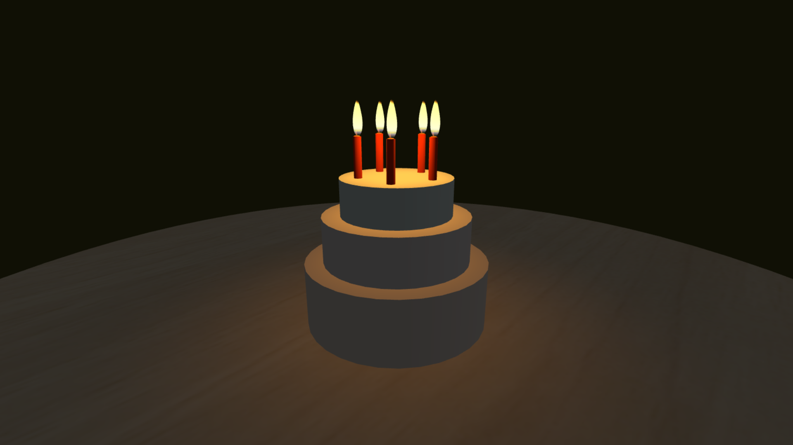

# Three.js Birthday Cake

A 3D birthday cake made with Three.js. It plays the "Happy Birthday" song and allows users to blow out candles.

The candle feature is primarily based on the Codepen [The Lonely Candle](https://codepen.io/prisoner849/pen/XPVGLp) by [prisoner849](https://codepen.io/prisoner849).

[Live Demo](https://surprise.leowang.dev/)

## Preview

A 3D cake that rotates and plays "Happy Birthday" song in the backgroud.

## Features

- Displays a 3D birthday cake with candles
- Plays the "Happy Birthday" song
- After the song ends, users can blow out the candles by holding down the mouse
- Once the candles are extinguished, a birthday message appears

## Development

1. Clone the repository
2. Install dependencies with `yarn`
3. Run the project with `yarn dev`

## Credits

- [The Lonely Candle Codepen](https://codepen.io/prisoner849/pen/XPVGLp)
- [Happy Birthday song (YouTube)](https://www.youtube.com/watch?v=aF8voKa_3Us)

## Disclaimer

Hey there! If I've accidentally used something I shouldn't have, please let me know. I'm all about respecting others' work, so if you spot anything that belongs to you and you're not cool with me using it, just send me an email. I'll take it down as soon as possible! Thanks for understanding, and happy coding! 🚀

Contact me at: [ascodeasice@gmail.com](mailto:ascodeasice@gmail.com)
